# ECMP: Limits of Static Hashing

## Overview
This repository is the submission for HW 2 in the course <bold>Networks for Data Centers and AI </bold>, Fall 2026, BGU.  
This submission implements a simulation framework to evaluate the performance of Equal-Cost Multi-Path (ECMP) routing in fat-tree topologies under various traffic patterns and link failure scenarios.   
The goal is to illustrate both the strengths and weaknesses of static ECMP routing, particularly in terms of load balancing and congestion management.  

**Objectives**  

Fat-tree topology offers full bisection bandwidth, yet static switch-localized ECMP can still create hotspots. 
This repo demonstrates the limitations of static localized ECMP hashing through two main scenarios:
- **Scenario A (Success)** – balanced traffic where ECMP distributes flows evenly.
- **Scenario B (Failure)** – traffic/topology combinations where ECMP overloads a few links despite sufficient aggregate capacity.  

For showing ECMO limitations, I compared the those runs with an adaptive `next_best_paths` strategy that chooses the path whose most congested link currently has the lowest load.

## Traffic & Routing Model
- **Topology**: classic fat tree parametrized by switch radix `k`. Links can be removed symmetrically to emulate failures (`links_fraction_to_remove`).  
- **simulation**: The network uses discrete micro event, iterating and connections to resemble a full-network-capacity application.   
- **Traffic generation**: Every routing event samples a permutation of destinations so each host sources exactly one flow and never targets itself, giving a consistent all-to-all load.
- **Routing methods**:
  For routing each flow, I compared two strategies - the inspected ECMP and a more adaptive reference. For focusing on the objectives, I considered only 6 hops paths, neglecting "bouncing" paths.
  - `ECMP`: probabilistic selection at switch level based on some even distributes random variable.
  - `next_best_paths`: greedily picks the least-loaded path using live link subscription counters inside each routing event.
- **Iterations**: for every tuple `(k, balance_mode, removal_fraction, routing_method)` we run multiple sending iterations nested inside multiple removal iterations, then persist link-load histograms.

## Repository Layout
```
output                                                                                                                                                                           
.gitignore                                                                                                                                                                       
main.py                                                                                                                                                                          
requirements.txt                                                                                                                                                                 
simple_fat_paths_draw.py                                                                                                                                                         
simple_fat_paths_draw_precise.py                                                                                                                                                 
simple_fat_paths_model.py                                                                                                                                                        
test_case_generator.py                                                                                                                                                           
```

## Running the Simulation
1. Create a virtual environment (optional) and install dependencies:
   ```powershell
   python -m venv .venv
   .\.venv\Scripts\activate
   pip install -r requirements.txt
   ```
2. Execute the bundled experiment sweep:
   ```powershell
   python main.py
   ```
   This calls `run_test_package()` and stores outputs under `output/`.
## implementation details  

### Model Object
The core of the simulation is encapsulated in the `SimpleFatTreeModel` class. This class implement simply the fat tree by enumerating all hosts, and every switch-level group (edges, aggregation, cores).
Then it connects them using simple mapping (lists). Thus it supports easily the bidirectional removal of links.
The Model supports also some self-utility functions, the creation of all possible paths between any 2 hosts, and 2 mechanisms for assigning actual path, simulating ECMP and wider topology aware routing.  
Below are some example visualizations of the fat-tree topologies used in the experiments:
<div style="display: flex; justify-content: space-around;">
    <figure style="width: 48%; margin: 1%; text-align: center;">
        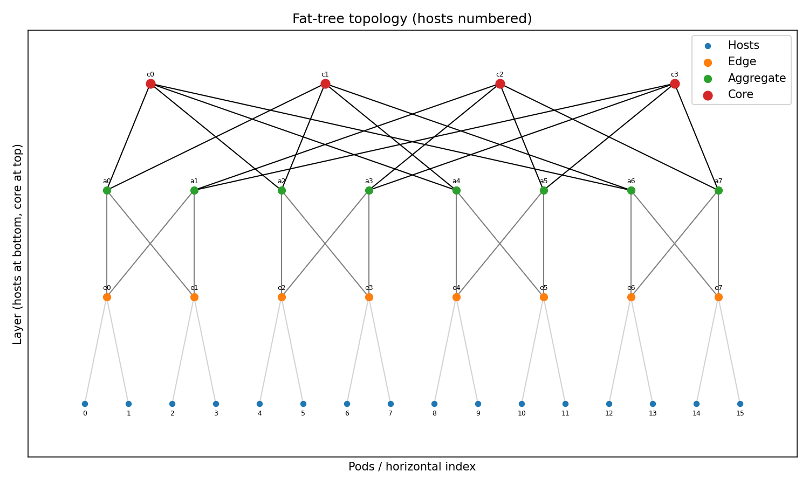
        <figcaption>Visualization of k=4 Fat Tree with no dropped links</figcaption>
    </figure>
    <figure style="width: 48%; margin: 1%; text-align: center;">
        
        <figcaption>Visualization of k=8 Fat Tree with 30% dropped links, unbalanced on the left side of the tree</figcaption>
    </figure>
</div>


### Routing Methods  
  
**Initialize**  

First we calculate all the possible 6-hop paths between every pair of hosts. This is done once per host to host connection.  
Then, for every routing event, we select one of these paths according to the routing method:  

**ECMP**  

Implemented as a product of switch-level evenly-distributed RVs. This is done for the switch-localized behavior of ECMP that choose (in the optimal case) a pseudo random equal cost port to attach the flow tot it. I assumed the ip addresses and ports change frequently so the selection is indeed pseudo ramdon.  
  
**Next Best Paths**  
  
Implemented as a greedy selection of the path whose most congested link currently has the lowest load.  
The idea was to emphasis the existence of better routing methods that can adapt to the current load.  


## Key Results & Evidence
Each run spans over multiple randomly chosen link removal of some fraction (to check various failures), with 2 methods: completely random failure (aka 'balanced'), and area bounded random failures (aka 'unbalanced').  
Each random failure spans of multiple connection distributions (permutations) to get statistical robustness.
Each run saves two kinds of artifacts per configuration:
1. **`layout_example_*` images** – topology snapshots after link removals (balanced vs unbalanced). This images support up to k=8 for graphical limitations.
2. **`fat_tree_*_package_hist.png` histograms** – link subscription distributions showing min/max bands, mean counts, and std bars.

## Test Case and Analysis    
  
For the discussion in this report, I chose the following scenarios to emphasis the ECMP strengths and limitations:  
1. Natural ECMP success: not link failures, over 8 and 12 Fat Tree topologies.
2. Extreme link failures (30% removals), unbalanced and balanced, over 8 and 12 Fat Tree topologies.  
In each scenario, I compared ECMP with the adaptive `next_best_paths` strategy.
The discussion will follow the figures below:  
### Scenario A: ECMP Success (No Link Failures)  
<div style="display: flex; justify-content: space-around;">
    <figure style="width: 48%; margin: 1%; text-align: center;">
        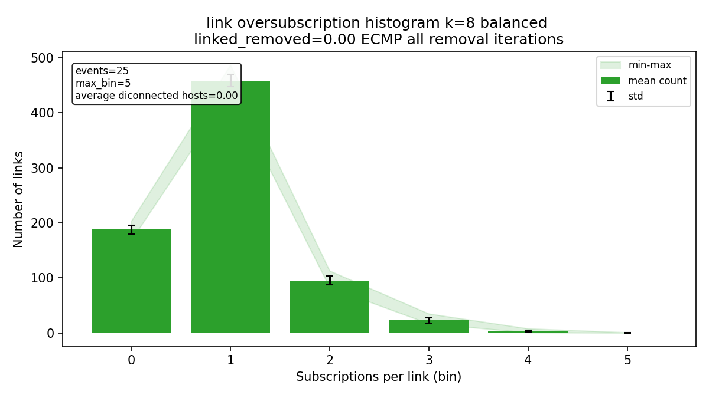
        <figcaption>ECMP in k=8 Fat Tree with no link failures</figcaption>
    </figure>
    <figure style="width: 48%; margin: 1%; text-align: center;">
        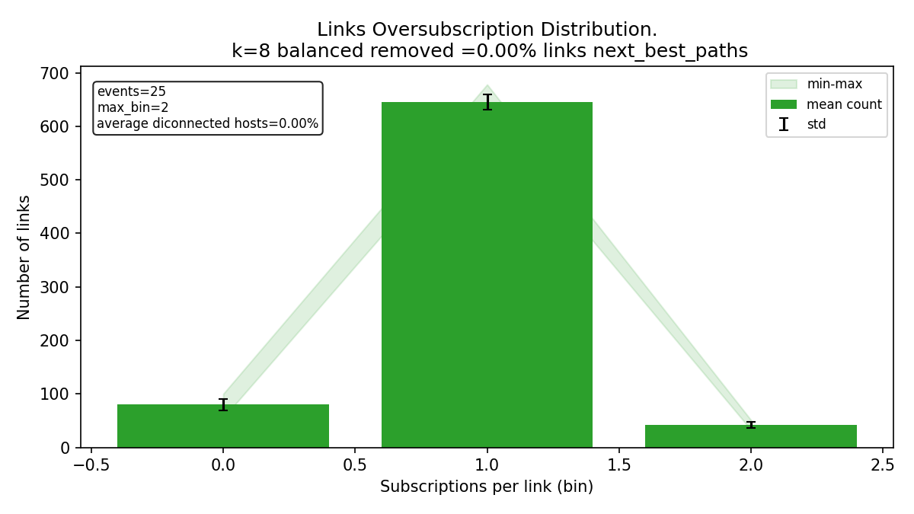
        <figcaption>Adaptive Routing in k=8 Fat Tree with no link failures</figcaption>
    </figure>
</div>
<div style="display: flex; justify-content: space-around;">
    <figure style="width: 48%; margin: 1%; text-align: center;">
        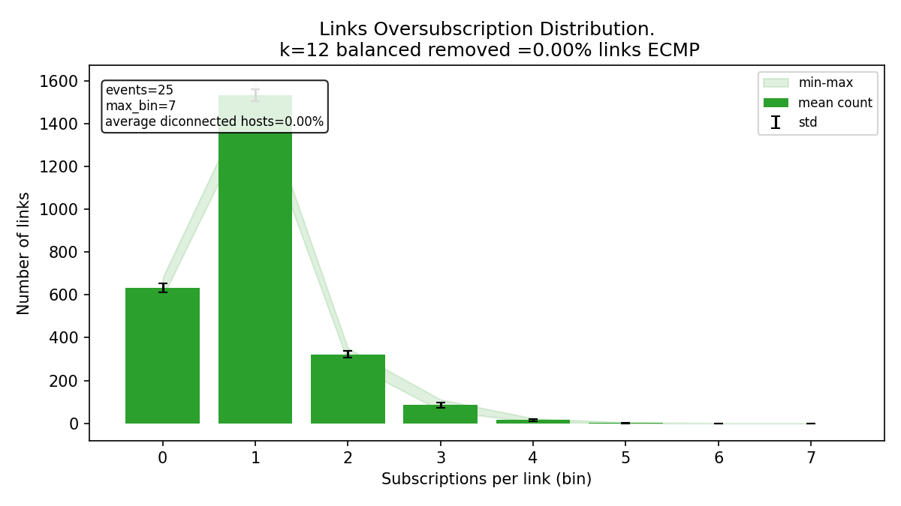
        <figcaption>ECMP in k=12 Fat Tree with no link failures</figcaption>
    </figure>   
    <figure style="width: 48%; margin: 1%; text-align: center;">
        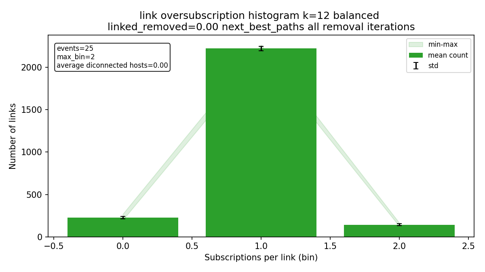
        <figcaption>Adaptive Routing in k=12 Fat Tree with no link failures</figcaption>
    </figure>
</div>
  
### Scenario B: ECMP Failure (30%) Link Failures)
#### Balanced:
<div style="display: flex; justify-content: space-around;">
    <figure style="width: 48%; margin: 1%; text-align: center;">
        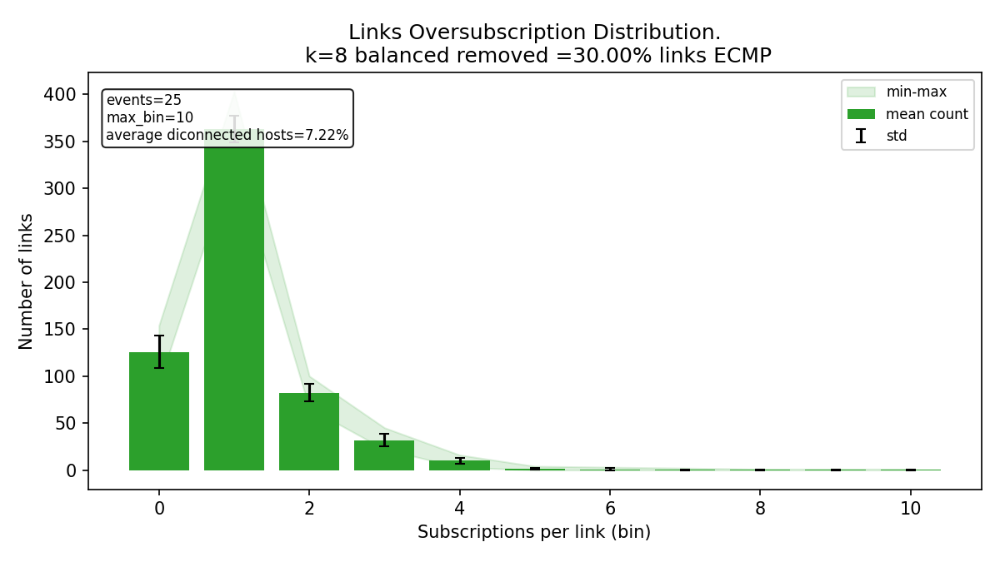
        <figcaption>average subscription:  ECMP in k=8 30% balanced link failures</figcaption>
    </figure>
    <figure style="width: 48%; margin: 1%; text-align: center;">
        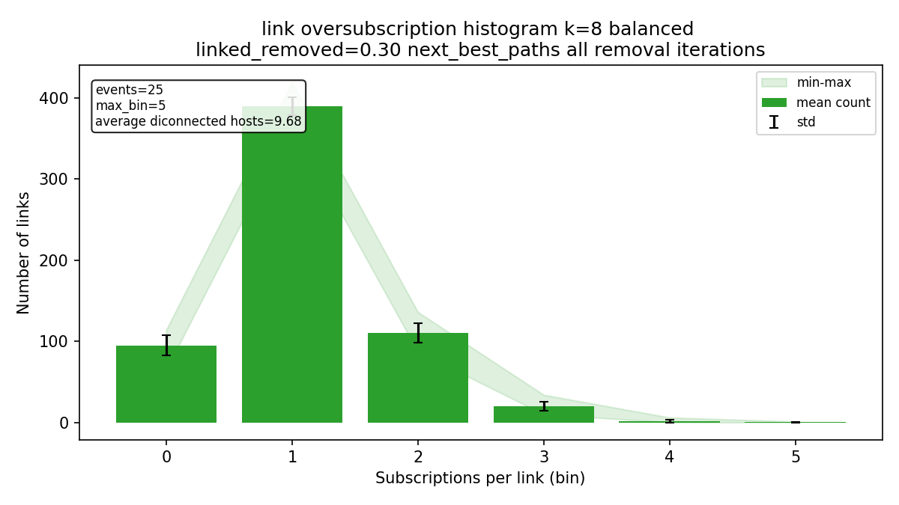
        <figcaption>average subscription: adaptive routing (reference) in k=8 30% balanced link failures</figcaption>
    </figure>
</div>

#### Unbalanced:
<div style="display: flex; justify-content: space-around;">
    <figure style="width: 48%; margin: 1%; text-align: center;">
        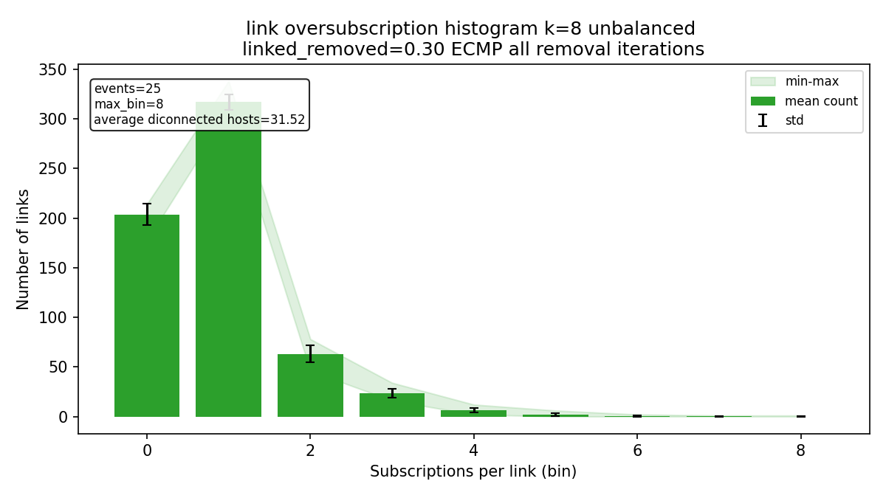
        <figcaption>average subscription:  ECMP in k=8 30% unbalanced link failures</figcaption>
    </figure>
    <figure style="width: 48%; margin: 1%; text-align: center;">
        
        <figcaption>average subscription: adaptive routing (reference) in k=8 30% unbalanced link failures</figcaption>
    </figure>
</div>

### ECMP Performance vs. Adaptive Routing: overage of Max Link Subscription
To quantify the performance difference between ECMP and the adaptive routing strategy, I calculated the  maximum link subscription across all configurations in each scenario. These are all averages over 5 iterations of random link removal X 5 iterations of random traffic permutations.

<div style="display: flex; justify-content: space-around;">
    <figure style="width: 48%; margin: 1%; text-align: center;">
        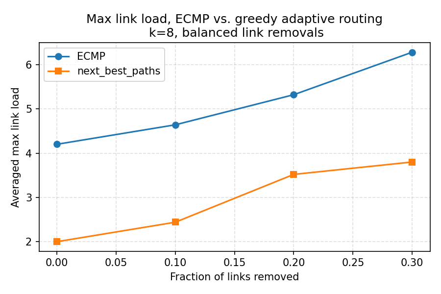
        <figcaption>Maximal link subscriptions for k=8 balanced link failures</figcaption>
    </figure>
    <figure style="width: 48%; margin: 1%; text-align: center;">
        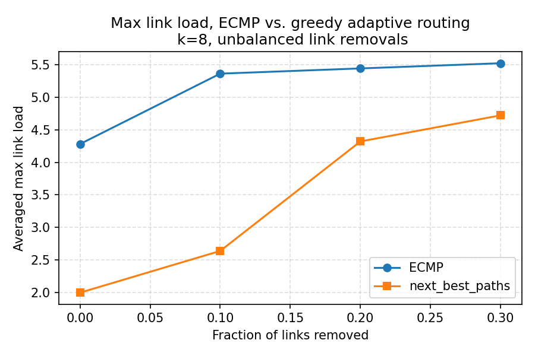
        <figcaption>Maximal link subscriptions for k=8 unbalanced link failures</figcaption>
    </figure>
</div>
<div style="display: flex; justify-content: space-around;">
    <figure style="width: 48%; margin: 1%; text-align: center;">
        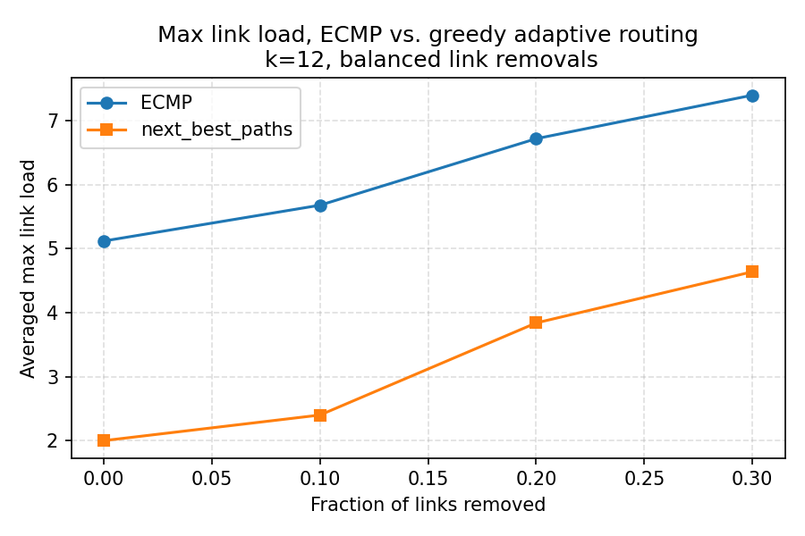
        <figcaption>Maximal link subscriptions for k=12 balanced link failures</figcaption>
    </figure>
    <figure style="width: 48%; margin: 1%; text-align: center;">
        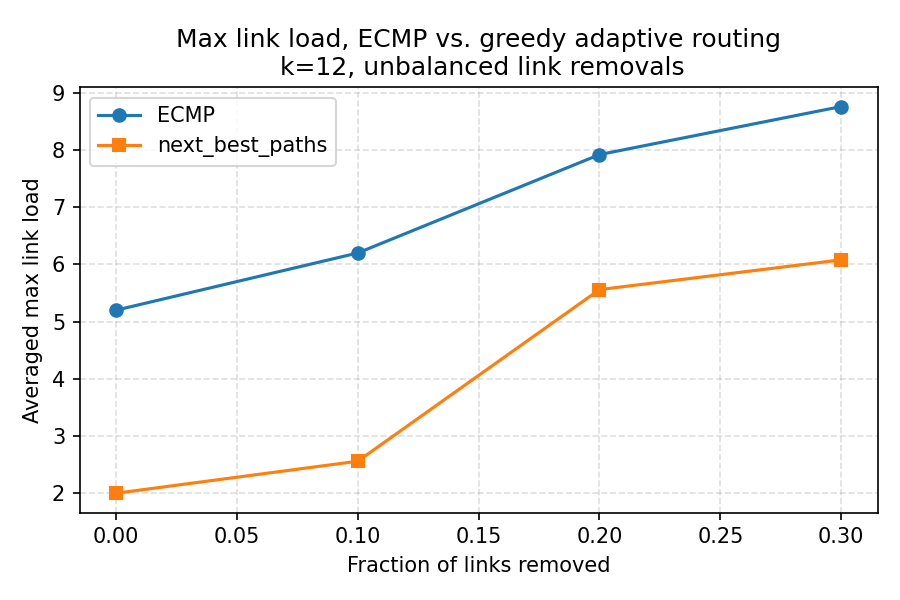
        <figcaption>Maximal link subscriptions for k=12 unbalanced link failures</figcaption>
    </figure>
</div>

## Interpreting the Plots
- **Scenario A**: We can see here a no removal scenario. The topology is balanced.  ECMP histograms show narrower distributions clustered at low subscription counts, indicating even load.  
Still, the greedy next best path shows that we theoretically could have established better paths, and that ECMP misses the full potential of the network.
- **Scenario B**: High Removal Fractions.  ECMP histograms present much longer tails than the next best path reference, and higher max bins.  
This means that certain links are highly oversubscribed while others remain underutilized.
This effect is more pronounced in unbalanced removals, where ECMP fails to adapt to the skewed topology, leading to severe congestion on a few links.
  
**Explanation:**  
In both scenarios, ECMP's local decision-making leads to suboptimal global load distribution. As a switch that practice ECMP hashing has no visibility into the overall network state, it cannot account for link failures or uneven traffic patterns.  
Thus, it occurs more often that a decision at the beginning of several paths lead to the same congested link, creating hotspots.


## Custom Experiments
Adjust the parameters at the top of `run_test_package()`:
- `k_s`: switch radices to evaluate.
- `links_fraction_to_remove`: removal ratios (0.0 → 0.4).
- `removal_iterations`, `sending_iterations`: statistical robustness.
- `routing_methods`: include or exclude strategies.

## Possible Next Steps
- Extend traffic models (e.g., unbalanced peers over the layout, bursty flows) to explore additional ECMP edge cases.
- Add CLI flags for selecting specific scenarios.
